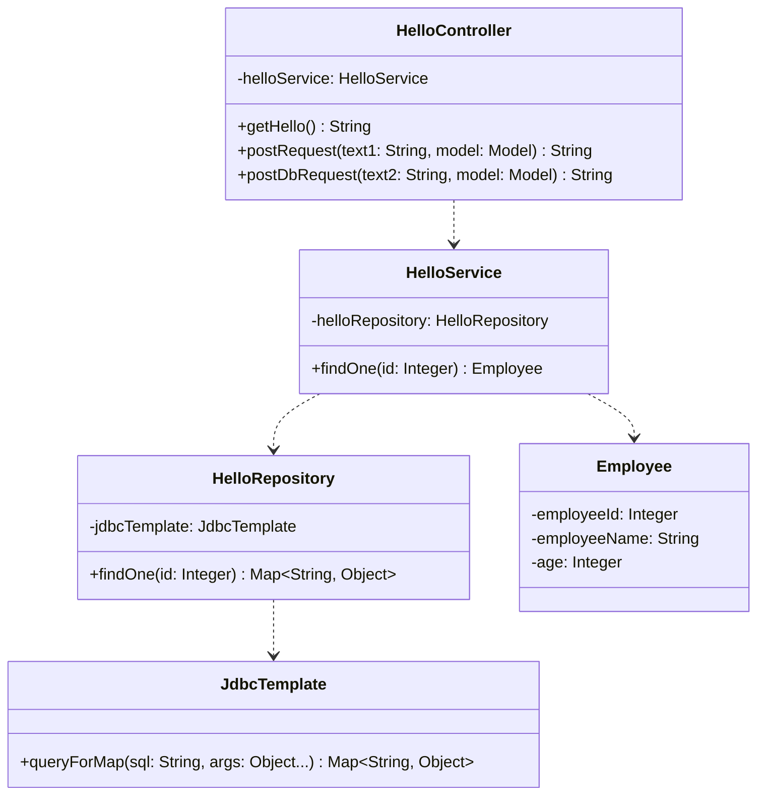
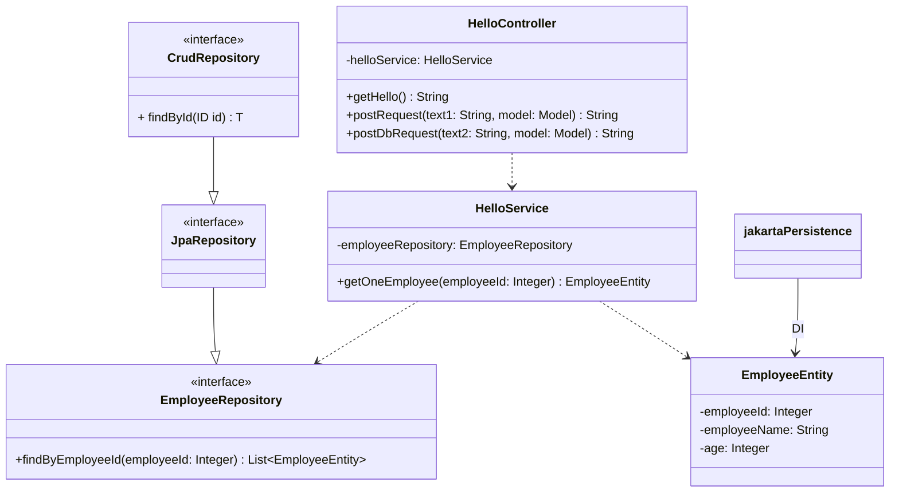

# jpaRepositoryの実装
## 概要
- springSampleプロジェクトのDBデータ取得をjdbcTemplateを使用した構成から、jpaRepositoryを使用する構成へのマイグレーション
- DBからの抽出を従業員全員抽出する機能を追加
- 

### クラス図
- ### 変更前

- ### 変更後

## 参考
### jpa、entityについて
- entityの詳細
https://terasolunaorg.github.io/guideline/current/ja/ArchitectureInDetail/DataAccessDetail/DataAccessJpa.html#data-access-jpa-how-to-use-way-to-add-entity
※本構築には(3)、(4)、(6)の実装で十分

- jpaRpository、entityの実装について
https://qiita.com/shukawam/items/6e379df031dccebddd36

- jpaRepository実装メソッドの命名規則
https://qiita.com/shindo_ryo/items/af7d12be264c2cc4b252

