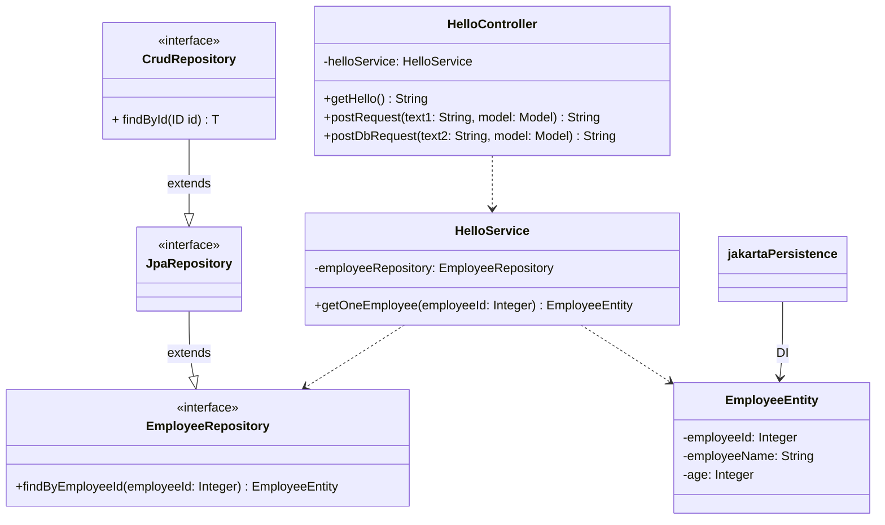

# jpaRepositoryの実装
## 概要
- springSampleプロジェクトのDBデータ取得を、jdbcTemplateを使用した構成から、jpaRepositoryを使用する構成へのリファクタリングを行うこと。
- DBからの抽出にSpring Data JPAのクエリ自動生成メソッドを実装すること。

### クラス図
- ### 変更前

- ### 変更後

## 参考
### jpa、entityについて
- entityの詳細
https://terasolunaorg.github.io/guideline/current/ja/ArchitectureInDetail/DataAccessDetail/DataAccessJpa.html#data-access-jpa-how-to-use-way-to-add-entity
※本構築には(3)、(4)、(6)の実装で十分

- jpaRpository、entityの実装について
https://qiita.com/shukawam/items/6e379df031dccebddd36

- jpaRepository実装メソッドの命名規則
https://qiita.com/shindo_ryo/items/af7d12be264c2cc4b252

### 実装のヒント
- 不足ライブラリのimport
- repositoryクラス内に独自メソッドを記述
- JPAを使用する場合、デフォルト設定ではH2データベースの初期化にはresources内のsqlを使わずにentityの定義に従って自動作成されるCREATE文が使用されるため、application.propertiesで自動作成設定をオフにすれば、resource内のsqlが実行される
- H2 DATABASEのコンソール 
    - http://localhost:8080/h2-console
        - url... jdbc:h2:mem:testdb